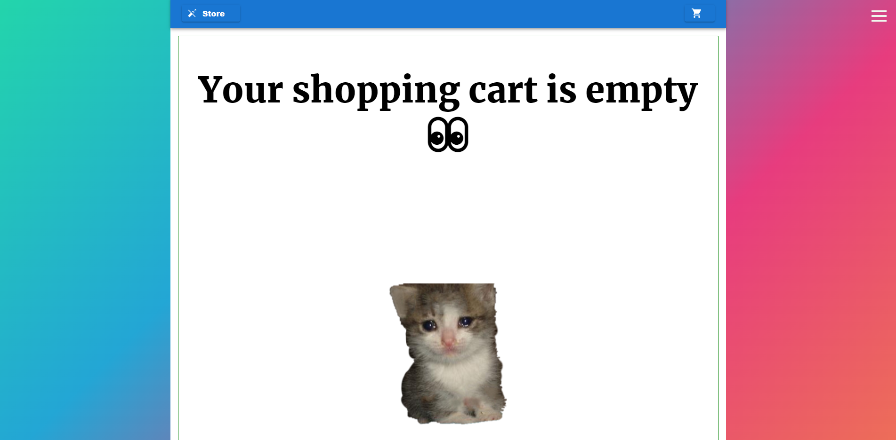
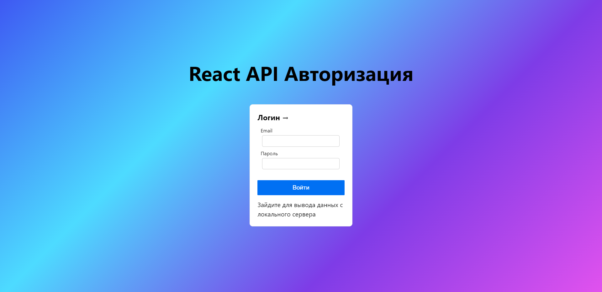
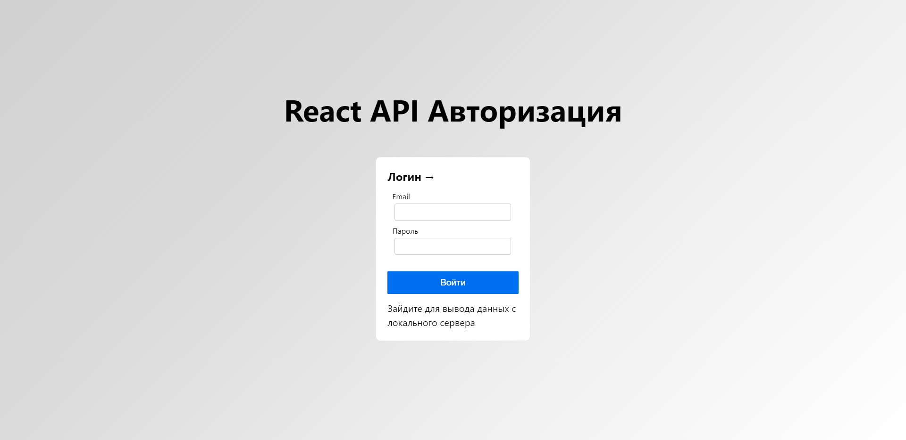
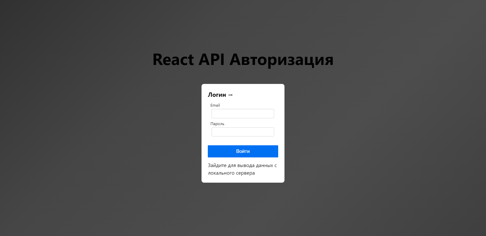
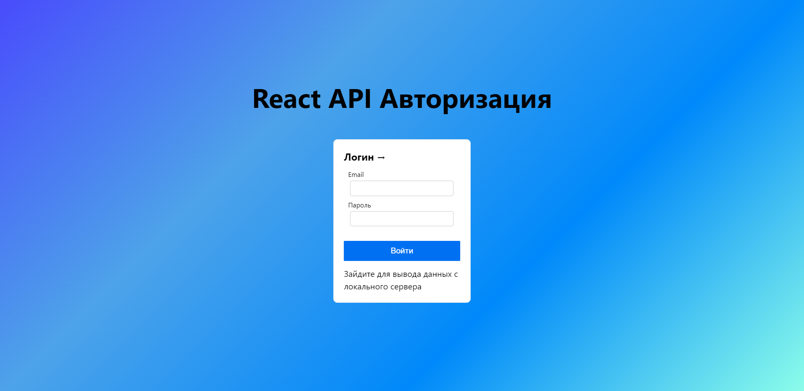
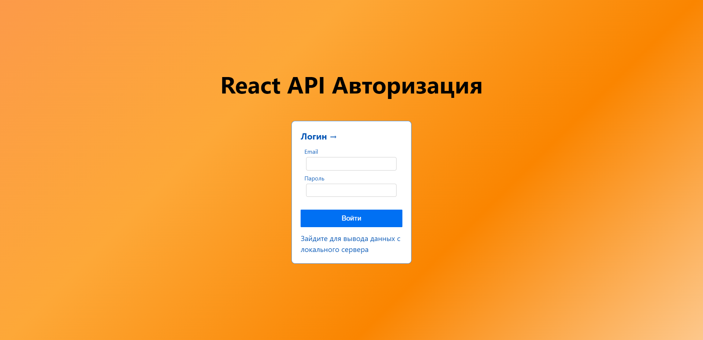
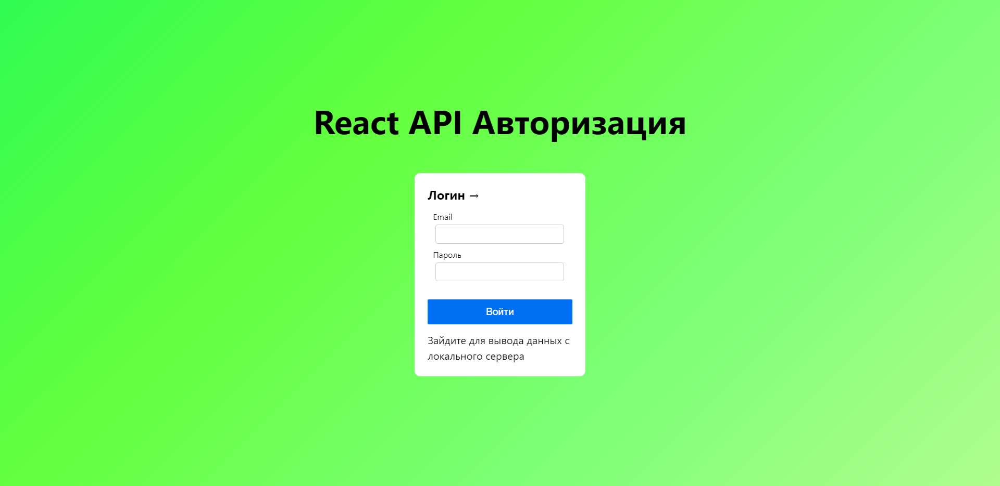
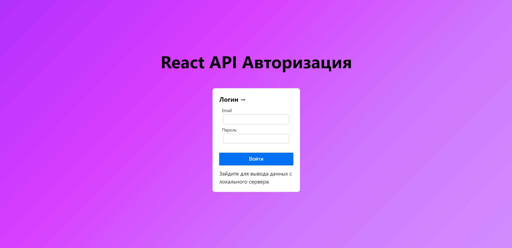

[](https://www.npmjs.com/package/gradient-background)
[](https://standardjs.com)


# Gradient-Background

### Easy way to add ```beauty background gradient``` on your websites. ``If you will like`` it i'm gonna add more gradient background themes for you


## Examples:
---




### Check demo here:
### https://komstore.vercel.app/


---

## Install:
```bash
npm i gradient-background
---
yarn add gradient-background
```

## Usage:
```jsx
// don't forget change props
import { GradientBackgroud } from 'gradient-background';


const App = () => {
  return (
    <div>
      <GradientBackgroud color='primary'/>
    </div>
  );
};
```

---
## Colors in start positions:
### primary:


### secondary:


### white:


### dark:


### blue:


### orange:


### green:


### purple:



---
## Props:
### They are limited for responsive solution (all be good in mobile too)

| props  | required | default  | description |
| ------------- | ------------- | ------------- | ------------- |
| color(string)| yes | primary | your background color |

